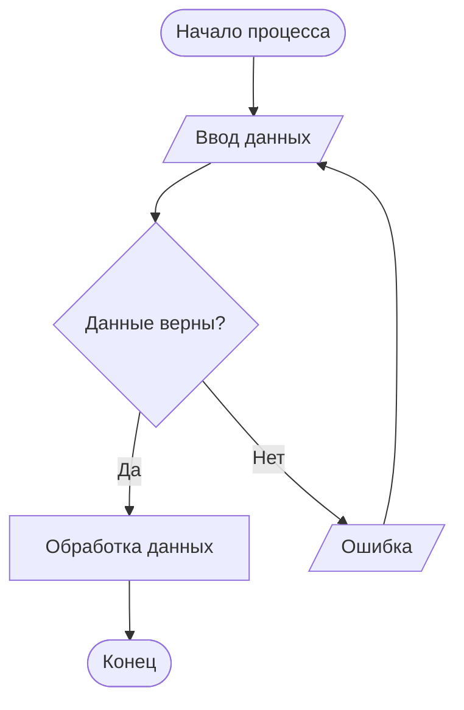
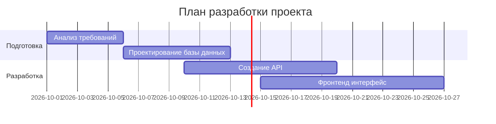
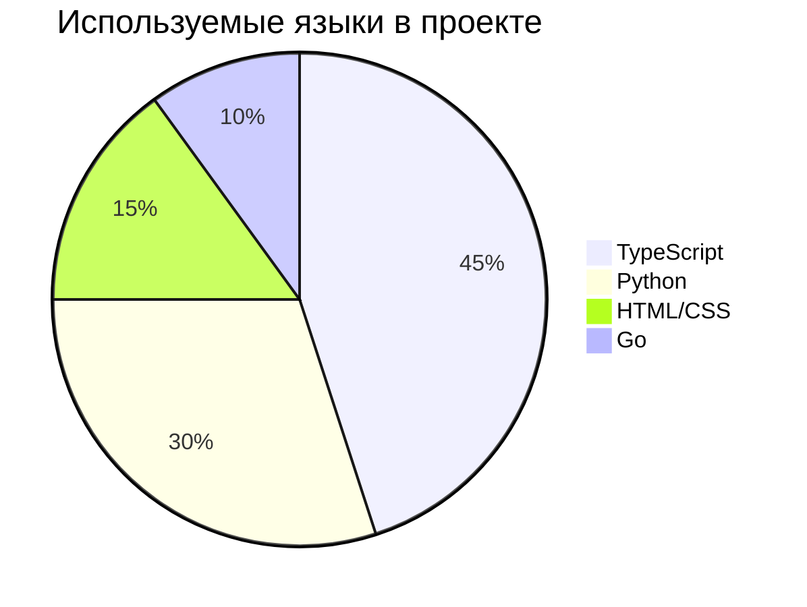

# Примеры диаграмм и блок-схем в Mermaid

В этом файле собраны основные типы диаграмм, которые можно строить с помощью синтаксиса Mermaid в Markdown.

## 1. Блок-схема (Flowchart)
Отображает алгоритмы, логику процессов и разветвления условий.



## 2. Диаграмма последовательности (Sequence Diagram)
Показывает взаимодействие между объектами или пользователями во времени (например, запросы к серверу).

```mermaid
sequenceDiagram
    actor Клиент
    participant Сервер
    database БД

    Клиент->>Сервер: Авторизация (Логин/Пароль)
    Сервер->>БД: Проверка пользователя
    БД-->>Сервер: Пользователь найден
    Сервер-->>Клиент: Токен доступа (Успешно)
```

## 3. Диаграмма Ганта (Gantt Chart)
Используется для планирования задач, управления проектами и отображения временных шкал.



## 4. Круговая диаграмма (Pie Chart)
Отлично подходит для наглядного отображения долей, процентов или статистики.


